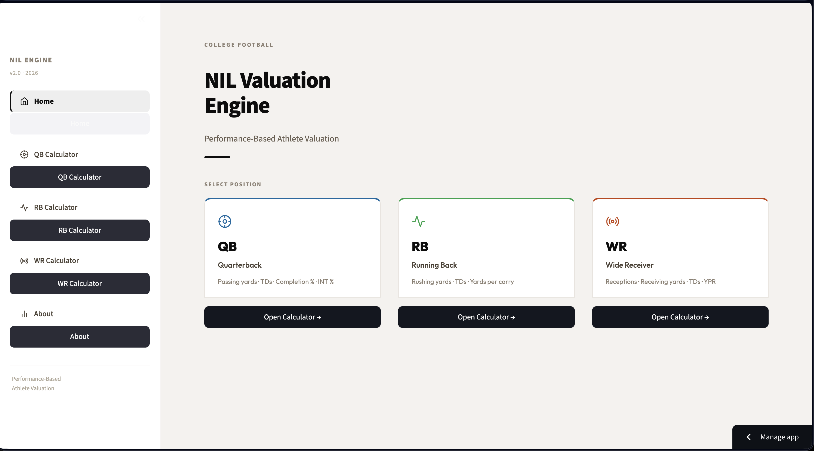
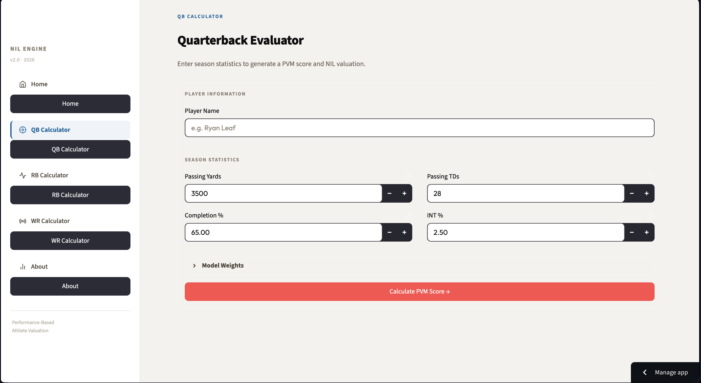
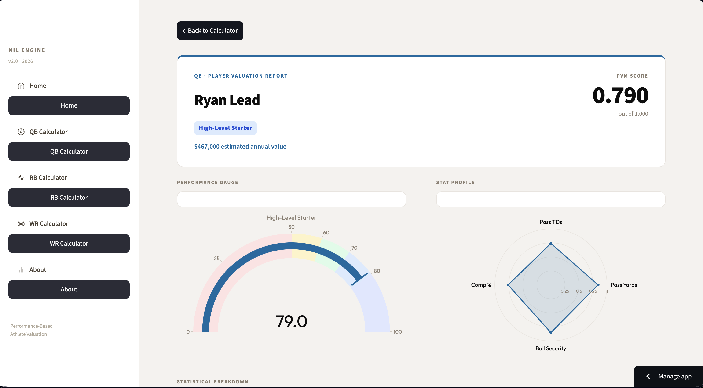
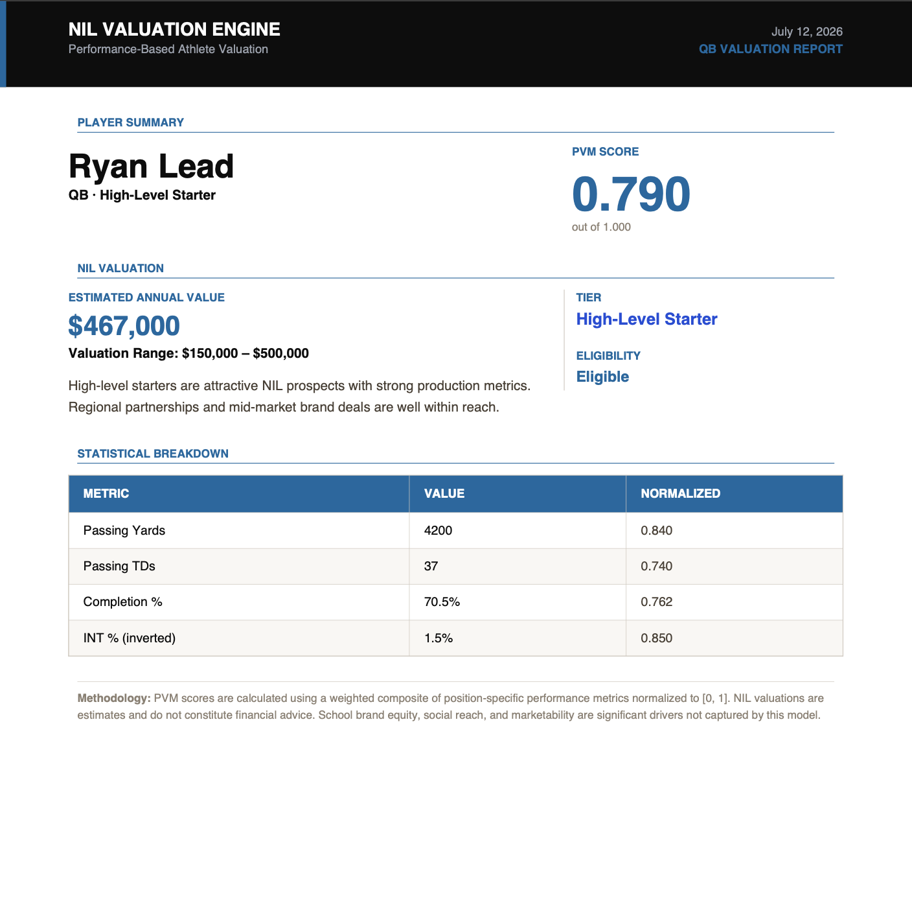

# NIL_2026
Performance-Based College Football NIL Valuation Engine
# NIL Valuation Engine

A performance-based athlete valuation platform that estimates NCAA football NIL (Name, Image, and Likeness) value using a custom Player Value Model (PVM).

Built as part of an undergraduate research project examining whether on-field performance aligns with modern NIL market valuations.

---

## App Demo

Streamlit App:
https://nilproject2026pkar.streamlit.app

---

## Project Overview

The NIL Valuation Engine evaluates college football athletes by generating a Player Value Model (PVM) score based on position-specific production and efficiency metrics.

Unlike existing NIL valuations that are heavily influenced by recruiting rankings, media exposure, and brand recognition, this project attempts to measure athlete value from an on-field performance perspective.

The application currently supports:

- Quarterbacks
- Running Backs
- Wide Receivers

---

##  Features

- Position-specific Player Value Models (PVM)
- Interactive Streamlit dashboard
- Position-specific weighting framework
- Performance normalization using Min-Max Scaling
- Tier classification system
- Estimated NIL valuation recommendations
- Radar chart visualization
- Performance gauge
- Downloadable PDF valuation reports

---

## Technologies Used

- Python
- Streamlit
- Plotly
- NumPy
- ReportLab
- Git
- GitHub

---

## Methodology

Each athlete is evaluated using a weighted Player Value Model (PVM).

The model uses position-specific statistics that are normalized using Min-Max Scaling before applying weighted performance metrics.

### Quarterbacks

- Passing Yards
- Passing Touchdowns
- Completion Percentage
- Interception Percentage (Inverted)

### Running Backs

- Rushing Yards
- Rushing Touchdowns
- Yards Per Carry

### Wide Receivers

- Receptions
- Receiving Yards
- Receiving Touchdowns
- Yards Per Reception

The resulting PVM score is used to classify players into valuation tiers and estimate a recommended NIL valuation.

---

##  Research Focus

This project accompanies a research paper investigating the relationship between:

- Player Performance
- Player Value Model (PVM)
- Public NIL Valuations

The analysis compares custom player rankings against publicly available NIL valuations to evaluate whether athlete compensation aligns with on-field production.

---

## Screenshots

### Home Page




### Quarterback Calculator




### Results Dashboard



### PDF Report



---

## Installation

Clone the repository

```bash
git clone https://github.com/fpushkar54/NIL_2026.git
```

Install dependencies

```bash
pip install -r requirements.txt
```

Run the application

```bash
streamlit run app.py
```

---

##  Repository Structure

```
NIL_2026
│
├── app.py
├── backend/
├── ui/
├── assets/
├── requirements.txt
└── README.md
```

---

##  Future Improvements

- Additional player positions
- Automated data pipeline
- Historical season comparison
- Advanced statistical validation
- Machine learning–based valuation models

---

## Author

Pushkar Pushkar

Arizona State University

W. P. Carey School of Business

---

##  License

This project is licensed under the MIT License.
